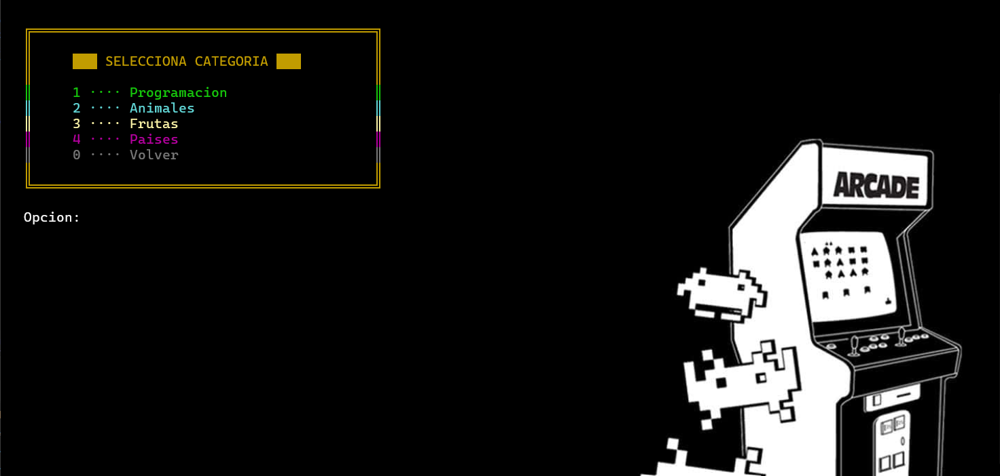
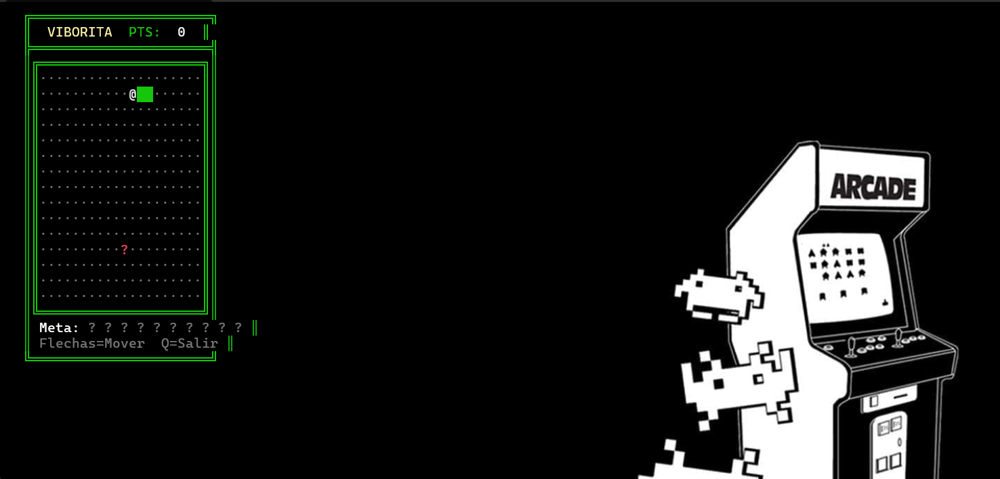
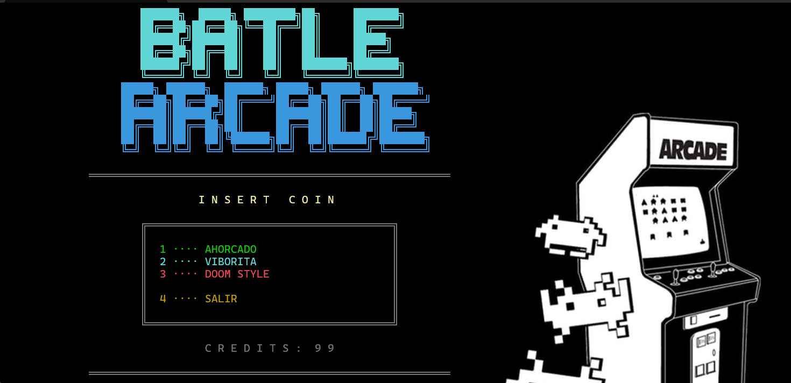

#  Battle Arcade — Centro de Juegos de Consola

<p align="center">
  
</p>

---

##  Descripción

**Battle Arcade** es una colección de tres videojuegos desarrollados en **C# con .NET**, ejecutables desde una terminal con interfaz estilo arcade retro. El proyecto demuestra la aplicación de principios de **Programación Orientada a Objetos**, patrones de diseño, manejo de interfaces y estructuras de datos avanzadas.

---

## 🎮 Juegos Incluidos

<table>
  <tr>
    <td align="center" width="33%">
      <br/>
      <b>Ahorcado</b><br/>
      Adivina la palabra antes de quedarte sin vidas
    </td>
    <td align="center" width="33%">
      <br/>
      <b>Viborita</b><br/>
      El clásico Snake con gráficos Unicode
    </td>
    <td align="center" width="33%">
      <br/>
      <b>Doom Style</b><br/>
      Shooter pseudo-3D con raycasting en ASCII
    </td>
  </tr>
</table>

---

## 🏗️ Arquitectura del Proyecto

```
Ahorcado/
│
├── Program.cs                     # Menú principal estilo arcade
│
├── 🎯 AHORCADO
│   ├── juego.cs                   # Motor principal del ahorcado
│   ├── MotorAhorcado.cs           # Lógica del juego
│   ├── ConsolaUI.cs               # Interfaz de usuario
│   ├── PalabrasEnMemoria.cs       # Repositorio de palabras
│   └── IRepositorioPalabras.cs    # Interfaz del repositorio
│
├── 🐍 VIBORITA
│   ├── IMotorViborita.cs          # Motor del juego Snake
│   ├── ConsolaUIViborita.cs       # Interfaz con Unicode
│   └── iMotorjuego.cs             # Interfaz base
│
├── 💥 DOOM STYLE
│   ├── MotorDoom.cs               # Motor de raycasting pseudo-3D
│   ├── MapaDoom.cs                # Sistema de mapas y niveles
│   ├── Jugador.cs                 # Clase del jugador
│   ├── EnemigoDoom.cs             # Sistema de enemigos con IA
│   ├── Enemigo.cs                 # Clase base de enemigos
│   └── Disparo.cs                 # Sistema de disparos
│
└── README.md
```

---

##  Requisitos

| Requisito | Versión |
|-----------|---------|
| .NET SDK | 6.0 o superior |
| Visual Studio | 2022+ |
| Sistema Operativo | Windows 10/11 |
| Terminal | Windows Terminal (recomendado) |

---

## ⚙️ Instalación y Ejecución

```bash
# Clonar el repositorio
git clone https://github.com/tu-usuario/Ahorcado.git

# Entrar al directorio
cd Ahorcado

# Compilar
dotnet build

# Ejecutar
dotnet run
```

---

## 📸 Capturas de Pantalla

### Menú Principal
<p align="center">
  
</p>

### Ahorcado
<p align="center">
  
</p>

### Viborita
<p align="center">
  
</p>

### Doom Style
<p align="center">
  
</p>

---

## 🎯 Características Principales

### Ahorcado
- Sistema de categorías (Programación, Animales, Frutas, Países)
- Pistas automáticas al tercer error
- Interfaz con corazones de vida ♥♡
- Título ASCII art

### Viborita
- Gráficos Unicode (█ ◆ · @)
- Barra de progreso visual ■□
- Bordes dobles estilizados
- Sistema de puntuación

### Doom Style
- Motor de raycasting pseudo-3D
- Pistola ASCII animada con muzzle flash
- 4 tipos de enemigos con IA (Zombi, Demonio, Cacodemon, Baron)
- 2 niveles con diferentes tipos de muros
- HUD con barras de vida y munición
- Animación de muerte y pantallas de victoria

---

## 🌿 Ramas del Repositorio

| Rama | Descripción |
|------|-------------|
| `master` | Rama principal con todos los juegos integrados |
| `FEAT/viborita3B` | Desarrollo del juego Viborita |
| `FEAT/doom-style` | Desarrollo del juego Doom Style |

---

## 🛠️ Tecnologías Utilizadas

- **Lenguaje:** C# 10
- **Framework:** .NET 6.0+
- **IDE:** Visual Studio 2022
- **Control de Versiones:** Git / GitHub
- **Paradigma:** Programación Orientada a Objetos (POO)
- **Patrones:** Interfaces, Herencia, Polimorfismo

---

## 👨‍💻 Autor

**Humberto Ramírez Gruintal**
Estudiante de Ingeniería en Software — Tecnológico de Software

<p align="center">
  
</p>

---

## 🤖 Cláusula de Uso de Inteligencia Artificial

> **Declaración de uso de herramientas de IA**
>
> Yo, **Humberto Ramírez Gruintal**, estudiante de Ingeniería en Software del **Tecnológico de Software**, 
> declaro que en el desarrollo de este proyecto se utilizó **inteligencia artificial (Claude, de Anthropic)** 
> Para la Correcion de Errores y la mejora de interfaz grafica de sistema. 
>
> **Fecha:** Mayo 2026
> **Institución:** Tecnologico de Software

---

## 📄 Licencia

Este proyecto fue desarrollado con fines académicos como parte del programa de Ingeniería en Software del Tecnológico de Software.

---

<p align="center">
  <i>Desarrollado con ❤️ por Humberto Ramírez Gruintal — Tec de Software, 2026</i>
</p>