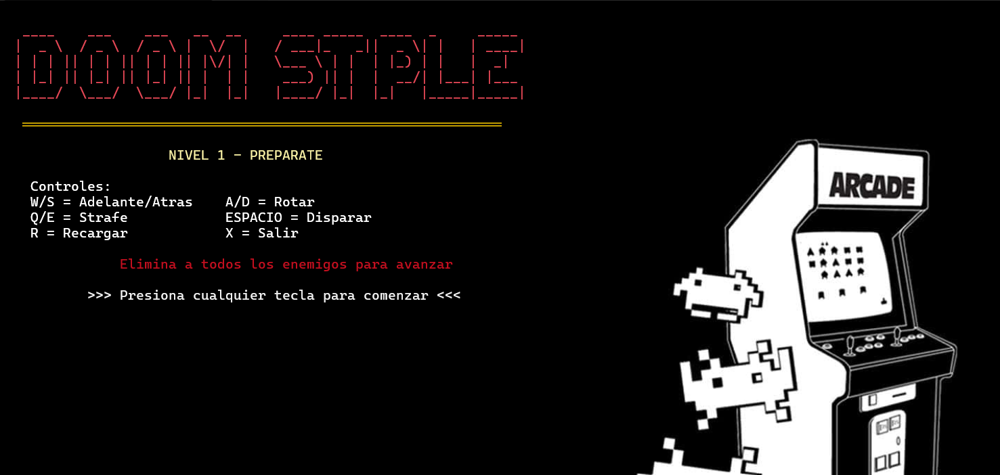
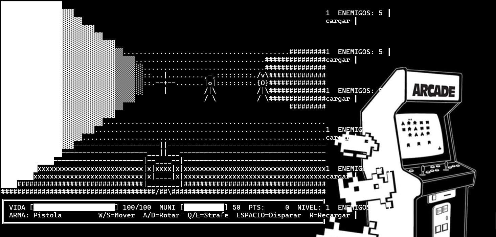
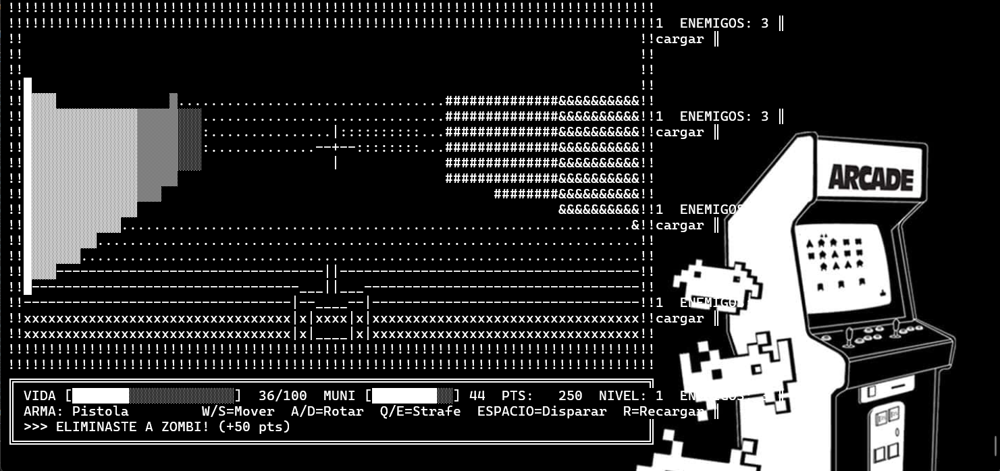

# ?? Doom Style — Shooter Pseudo-3D en Consola

<p align="center">
  
</p>

---

## ?? Descripción

**Doom Style** es un videojuego de disparos en primera persona desarrollado en **C# para consola**, que implementa un motor de **raycasting pseudo-3D** renderizado completamente en caracteres ASCII. Inspirado en el clásico DOOM (1993), el juego permite explorar niveles, combatir enemigos con IA y avanzar a través de múltiples niveles de dificultad.

---

## ?? Gameplay

<p align="center">
  
</p>

---

## ??? Controles

| Tecla | Acción |
|-------|--------|
| `W` | Mover adelante |
| `S` | Mover atrás |
| `A` | Rotar izquierda |
| `D` | Rotar derecha |
| `Q` | Strafe izquierda |
| `E` | Strafe derecha |
| `Espacio` | Disparar |
| `R` | Recargar |
| `X` | Salir |

---

## ??? Arquitectura de Clases

```
MotorDoom.cs : iMotorJuego
?
??? Raycasting Engine
?   ??? LanzarRayo()                ? Calcula distancia a muros
?   ??? ObtenerCaracterMuro()       ? Textura según distancia (????)
?   ??? RenderizarEnemigos()        ? Sprites basados en distancia
?   ??? DibujarArmaEnBuffer()       ? Pistola ASCII animada
?
??? MapaDoom.cs
?   ??? Grid 16x16 con tipos de muros
?   ??? Nivel1() / Nivel2()         ? Layouts de niveles
?   ??? EsMuro()                    ? Detección de colisiones
?   ??? ObtenerSpawn()              ? Punto de inicio
?
??? Jugador.cs
?   ??? MoverAdelante/Atras()       ? Con colisión
?   ??? MoverIzquierda/Derecha()    ? Strafe
?   ??? RotarIzquierda/Derecha()    ? Rotación
?   ??? Disparar()                  ? Sistema de munición
?   ??? RecibirDano() / Curar()     ? Sistema de vida
?
??? EnemigoDoom.cs
    ??? 4 tipos: Zombi, Demonio, Cacodemon, Baron
    ??? Perseguir()                 ? IA de persecución
    ??? PuedeAtacar()               ? Rango de ataque
    ??? ObtenerSprite()             ? ASCII art por distancia
    ??? DistanciaA()                ? Cálculo de distancia
```

---

## ?? Sistema de Enemigos

<p align="center">
  
</p>

| Tipo | Vida | Daño | Puntos | Velocidad | Sprite |
|------|------|------|--------|-----------|--------|
| Zombi | 20 | 5 | 50 | Lenta | `Z` |
| Demonio | 40 | 10 | 100 | Media | `D` |
| Cacodemon | 80 | 20 | 200 | Lenta | `C` |
| Baron | 150 | 30 | 500 | Muy lenta | `B` |

### Sprites por Distancia

**Muy cerca (<3 unidades):**
```
 /vvv\
 {O O}
 |/\/\|
  /|\
 //|\\
```

**Media distancia (3-6):**
```
 /v\
 {O}
 /|\
```

**Lejos (6-10):** `D /|\`

**Muy lejos (>10):** `.`

---

## ?? Sistema de Armas

<p align="center">
  
</p>

### Estado Normal
```
           ||
        ___||___
       |  ____  |
       | |    | |
       | |____| |
       |________|
          /  \
```

### Disparando (Muzzle Flash)
```
          \\|//
          -***-
          //|\\
           ||
        ___||___
```

### Recargando
```
       |  ____  |  *clic*
       | |    | |
```

---

## ??? Sistema de Mapas

Los niveles están definidos como matrices 16x16 con diferentes tipos de muros:

| Código | Tipo | Textura Cercana | Textura Lejana |
|--------|------|-----------------|----------------|
| 0 | Vacío | (espacio) | (espacio) |
| 1 | Ladrillo | ? ? ? | ? : . |
| 2 | Piedra | % & # | + : . |
| 3 | Metal | = \| I | ! : . |
| 4 | Puerta | [ + | / . |

---

## ?? Efectos Visuales

- **Muzzle Flash:** Destello al disparar
- **Flash de Daño:** Bordes rojos `!!!` al recibir daño
- **Crosshair:** Mira `--+--` en el centro
- **Kill Feed:** Mensajes de eliminación
- **Animación de Muerte:** Pantalla se llena de `X`
- **YOU DIED:** Texto ASCII art al morir
- **Pantalla de Victoria:** ASCII art al completar niveles

---

## ?? Capturas de Pantalla

### Pantalla de Inicio
<p align="center">
  
</p>

### Combate
<p align="center">
  
</p>

### Game Over
<p align="center">
  
</p>

### Victoria
<p align="center">
  
</p>

---

## ?? Conceptos Técnicos Implementados

| Concepto | Aplicación |
|----------|------------|
| **Raycasting** | Proyección pseudo-3D calculando distancia de rayos a muros |
| **Buffer de renderizado** | Array 2D de caracteres para evitar parpadeo |
| **Depth buffer** | Array de profundidad para oclusión de enemigos |
| **IA básica** | Enemigos persiguen al jugador con pathfinding simple |
| **Sprite scaling** | Tamaño de enemigos varía según distancia |
| **Collision detection** | Movimiento validado contra el mapa |
| **Game loop** | Input ? Update ? Render a 50ms por frame |

---

## ?? Principios de POO

| Principio | Implementación |
|-----------|---------------|
| **Encapsulamiento** | Propiedades privadas, métodos públicos definidos |
| **Abstracción** | `iMotorJuego` define el contrato del motor |
| **Herencia** | Tipos de enemigos con stats diferentes |
| **Polimorfismo** | `MotorDoom` implementa `iMotorJuego` |
| **SRP** | Cada clase tiene una única responsabilidad |

---

## ????? Autor

**Humberto Ramírez Gruintal**
Estudiante de Ingeniería en Software — Tecnológico de Software
<p align="center">
  
</p>

---

## ?? Cláusula de Uso de Inteligencia Artificial
>    
> Declaración de uso de herramientas de IA
>
> Yo, Humberto Ramírez Gruintal, estudiante de Ingeniería en Software del Tecnológico de Software, 
> declaro que en el desarrollo de este proyecto se utilizó inteligencia artificial (Claude, de Anthropic) 
> Para la Correcion de Errores y la mejora de interfaz grafica de sistema.
>
> Fecha: Mayo 2026 Institución: Tecnologico de Software
>

<p align="center">
  <i>Desarrollado con ?? por Humberto Ramírez Gruintal — Tec de Software, 2026</i>
</p>